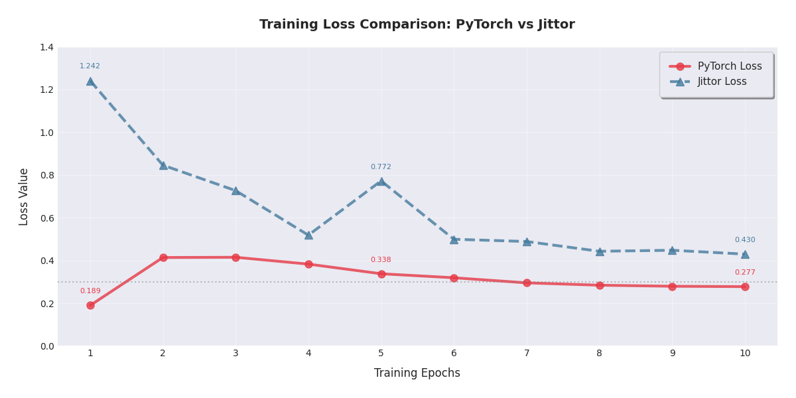
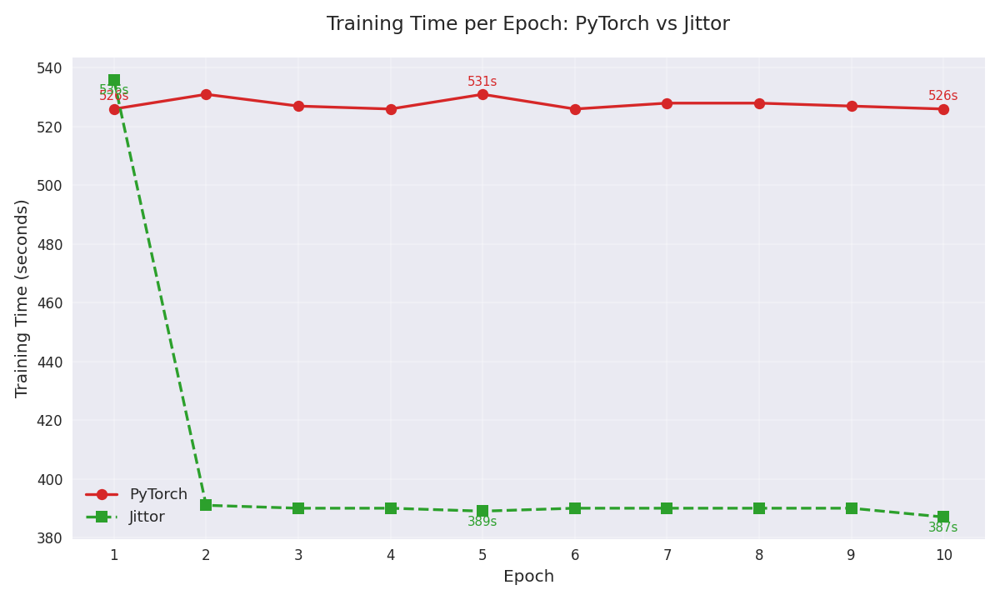

# RetinaSet 双框架实现 (PyTorch & Jittor)

## 目录
- [环境配置](#环境配置)
  - [硬件配置](#硬件配置)
  - [PyTorch环境](#pytorch环境)
  - [Jittor环境](#jittor环境)
- [数据准备](#数据准备)
  - [数据集结构](#数据集结构)
- [训练流程](#训练流程)
  - [PyTorch训练](#pytorch训练)
  - [Jittor训练](#jittor训练)
- [测试评估](#测试评估)
  - [测试命令](#测试命令)
- [性能对比](#性能对比)
  - [精度指标](#精度指标)
  - [速度指标](#速度指标)

---

### 环境配置

##### 硬件环境

```
CPU:
13th Gen Intel(R) Core(TM) i9-13900H
GPU:
+-----------------------------------------------------------------------------------------+
| NVIDIA-SMI 580.65.05              Driver Version: 580.88         CUDA Version: 13.0     |
+-----------------------------------------+------------------------+----------------------+
| GPU  Name                 Persistence-M | Bus-Id          Disp.A | Volatile Uncorr. ECC |
| Fan  Temp   Perf          Pwr:Usage/Cap |           Memory-Usage | GPU-Util  Compute M. |
|                                         |                        |               MIG M. |
|=========================================+========================+======================|
|   0  NVIDIA GeForce RTX 4050 ...    On  |   00000000:01:00.0 Off |                  N/A |
| N/A   54C    P3             11W /   50W |       0MiB /   6141MiB |      0%      Default |
|                                         |                        |                  N/A |
+-----------------------------------------+------------------------+----------------------+

+-----------------------------------------------------------------------------------------+
| Processes:                                                                              |
|  GPU   GI   CI              PID   Type   Process name                        GPU Memory |
|        ID   ID                                                               Usage      |
|=========================================================================================|
|  No running processes found                                                             |
+-----------------------------------------------------------------------------------------+
```


##### PyTorch环境
```bash
# 创建Python 3.7环境
conda create -n pytorch_env python=3.7 -y
conda activate pytorch_env

# 安装PyTorch 1.12 + CUDA 11.3
conda install pytorch==1.12.1 torchvision==0.13.1 torchaudio==0.12.1 cudatoolkit=11.3 -c pytorch

# 安装依赖库
pip install -r requirements.txt
```

##### Jittor环境

```bash
# 新建一个 Conda 虚拟环境，安装Python 3.7
conda create -n jittor_env python=3.7
conda activate jittor_env
#安装 Jittor
python -m pip install jittor
#配置g++版本
sudo apt update
sudo apt install g++ # 或者指定版本如 g++-9
# 如果需要，配置 update-alternatives
# sudo update-alternatives --install /usr/bin/gcc gcc /usr/bin/gcc-9 90
# sudo update-alternatives --install /usr/bin/g++ g++ /usr/bin/g++-9 90
```

**测试**

```
python3.7 -m jittor.test.test_cudnn_op
```

### 数据准备

训练所需的retinanet_resnet50.pth和主干的权值可以在百度云下载。
链接： https://pan.baidu.com/s/1Qal7lmN3aV0ZHscB_1OmrA
提取码： ckv8

VOC数据集下载地址如下，里面已经包括了训练集、测试集、验证集（与测试集一样），无需再次划分：
链接： https://pan.baidu.com/s/1-1Ej6dayrx3g0iAA88uY5A
提取码： ph32

### 训练步骤

##### 数据集的准备

本文使用VOC格式进行训练，训练前需要下载好VOC07+12的数据集，解压后放在根目录

##### 数据集的处理

修改voc_annotation.py里面的annotation_mode=2，运行voc_annotation.py生成根目录下的2007_train.txt和2007_val.txt。

##### 开始训练

```
python train.py
```

### 测试步骤

##### 使用预训练权重

1. 下载完库后解压，在百度网盘下载权值，放入model_data，运行 predict.py，输入

   ```
   img/street.jpg
   ```

   

### 训练结果

##### loss函数




##### mAP


##### 性能对比

